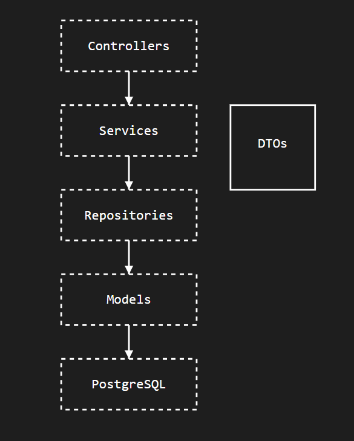

<div align="center">


# Sistema de Gerenciamento de Tarefas

<em>Aplicação para gerenciamento de tarefas com autenticação segura e operações CRUD completas</em>

<!-- BADGES -->
<p>


</p>

</div>

## 📋 Índice

- [Visão Geral](#visao-geral)
- [Arquitetura](#arquitetura)
- [Stack Tecnológica](#stack-tecnologica)
- [Estrutura do Projeto](#estrutura-do-projeto)
- [Diagrama de Classes](#diagrama-de-classes)
- [API Endpoints](#api-endpoints)
- [Configuração e Execução](#configuracao-e-execucao)
- [Testes e Qualidade](#testes-e-qualidade)
- [Demonstração Visual](#demonstracao-visual)
- [Roadmap Técnico](#roadmap-tecnico)
- [Contribuição](#contribuicao)
- [Contato](#contato)

## 🔍 Visão Geral

O Sistema de Gerenciamento de Tarefas é uma aplicação que implementa uma API RESTful completa para o gerenciamento de tarefas e categorias, com um frontend moderno em React. Desenvolvido utilizando práticas modernas de engenharia de software, este sistema oferece:

- Operações CRUD completas para tarefas e categorias
- Autenticação e autorização de usuários via JWT
- Frontend responsivo e intuitivo com React e Vite
- Persistência de dados com JPA/Hibernate
- Validação de dados em múltiplas camadas
- Tratamento de exceções centralizado
- Separação clara de responsabilidades (Clean Architecture)

Este projeto demonstra a implementação de padrões de projeto essenciais como Repository, Service, DTO, além de seguir princípios SOLID e práticas de código limpo.

## 🏗️ Arquitetura

O projeto segue uma arquitetura completa com backend e frontend:

### Backend (Spring Boot)



### Frontend (React + Vite + TypeScript)


Esta arquitetura permite:

- **Baixo acoplamento**: Dependências unidirecionais entre camadas
- **Alta coesão**: Cada camada tem responsabilidades bem definidas
- **Testabilidade**: Facilidade para testes unitários e de integração
- **Manutenibilidade**: Alterações têm impacto mínimo em outras partes do sistema
- **Experiência do usuário**: Interface moderna e responsiva com React

## 🛠️ Stack Tecnológica

### Backend
- **Java 21**: Recursos avançados de linguagem (records, sealed classes, etc.)
- **Spring Boot 3.x**: Framework para desenvolvimento de aplicações enterprise
- **Spring Security + JWT**: Autenticação e autorização segura
- **Spring Data JPA**: ORM para persistência de dados
- **PostgreSQL**: Sistema de banco de dados relacional robusto
- **Maven**: Gerenciamento de dependências e build

### Frontend
- **React 18+**: Biblioteca para construção de interfaces de usuário
- **TypeScript**: Tipagem estática para JavaScript
- **Vite**: Build tool e dev server de alta performance
- **React Router v6+**: Navegação entre páginas
- **Axios**: Cliente HTTP para consumo da API
- **Bootstrap**: Framework CSS para design responsivo
- **React Hook Form**: Gerenciamento de formulários

### Ferramentas de Desenvolvimento
- **JUnit 5**: Framework de testes unitários
- **Mockito**: Framework para mocks em testes
- **Spring Test**: Suporte a testes de integração
- **Vitest/Jest**: Testes para o frontend
- **ESLint/Prettier**: Linting e formatação de código

## 📁 Estrutura do Projeto

<details>
<summary><strong>Backend (clique para expandir)</strong></summary>

```
src/
├── main/
│   ├── java/com/devpablo/taskmanager/
│   │   ├── config/                       # Classes de configuração
│   │   │   ├── SecurityConfig            # Configuração de segurança
│   │   │   └── WebConfig                 # Configuração web
│   │   │
│   │   ├── controller/                   # REST Controllers
│   │   │   ├── AuthController            # Endpoints de autenticação
│   │   │   ├── CategoriaController       # Endpoints de categorias
│   │   │   ├── PainelController          # Endpoints de estatísticas do painel
│   │   │   ├── TarefaController          # Endpoints de tarefas
│   │   │   └── UsuarioController         # Endpoints de usuários
│   │   │
│   │   ├── dto/                          # Data Transfer Objects
│   │   │   ├── CategoriaRequestDTO       # Dados de entrada para categoria
│   │   │   ├── CategoriaResponseDTO      # Dados de saída para categoria
│   │   │   ├── LoginRequestDTO           # Dados para login
│   │   │   ├── TarefaRequestDTO          # Dados de entrada para tarefa
│   │   │   ├── TarefaResponseDTO         # Dados de saída para tarefa
│   │   │   ├── UsuarioRequestDTO         # Dados de entrada para usuário
│   │   │   └── UsuarioResponseDTO        # Dados de saída para usuário
│   │   │
│   │   ├── enums/                        # Enumerações
│   │   │   ├── CategoriaTarefa           # Tipos de categorias
│   │   │   ├── PrioridadeTarefa          # Níveis de prioridade
│   │   │   └── StatusTarefa              # Estados de tarefas
│   │   │
│   │   ├── exception/                    # Exceções personalizadas
│   │   │   ├── ErroResponse              # Formato padronizado de erros
│   │   │   └── GlobalExceptionHandler    # Tratamento central de exceções
│   │   │
│   │   ├── model/                        # Entidades JPA
│   │   │   ├── Categoria                 # Entidade Categoria
│   │   │   ├── Tarefa                    # Entidade Tarefa
│   │   │   └── Usuario                   # Entidade Usuario
│   │   │
│   │   ├── repository/                   # Interfaces de repositório
│   │   │   ├── CategoriaRepository       # Acesso a dados de categorias
│   │   │   ├── TarefaRepository          # Acesso a dados de tarefas
│   │   │   └── UsuarioRepository         # Acesso a dados de usuários
│   │   │
│   │   ├── security/                     # Implementação de segurança
│   │   │   ├── CustomUserDetails         # Detalhes do usuário personalizado
│   │   │   ├── JwtAuthFilter             # Filtro de autenticação JWT
│   │   │   └── JwtUtils                  # Utilitários para JWT
│   │   │
│   │   ├── service/                      # Camada de serviços
│   │   │   ├── CategoriaService          # Lógica de negócios para categorias
│   │   │   ├── TarefaService             # Lógica de negócios para tarefas
│   │   │   └── UsuarioService            # Lógica de negócios para usuários
│   │   │
│   │   └── TaskManagerApplication.java   # Classe principal Spring Boot
│   │
│   └── resources/                        # Recursos da aplicação
│       └── application.properties        # Configurações da aplicação
│
└── test/                                 # Testes automatizados
    └── java/com/devpablo/taskmanager/
        └── service/                      # Testes de serviços
            ├── CategoriaServiceTest      # Testes para serviço de categorias
            ├── TarefaServiceTest         # Testes para serviço de tarefas
            ├── UsuarioServiceTest        # Testes para serviço de usuários
            └── TaskManagerApplicationTest # Testes de integração
```

</details>

<details>
<summary><strong>Frontend (clique para expandir)</strong></summary>

```
frontend/
├── public/                    # Arquivos públicos estáticos
│   └── vite.svg               # Ícone do Vite
│
├── src/
│   ├── assets/                # Recursos estáticos
│   │
│   ├── pages/                 # Páginas da aplicação
│   │   ├── Login.tsx          # Página de login
│   │   ├── Painel.tsx         # Dashboard com estatísticas
│   │   ├── Register.tsx       # Página de cadastro 
│   │   └── Tarefas.tsx        # Página de gerenciamento de tarefas
│   │
│   ├── services/              # Serviços e integrações
│   │   ├── auth.ts            # Serviço de autenticação
│   │   └── tarefas.ts         # Serviço para operações com tarefas
│   │
│   ├── App.css                # Estilos globais
│   ├── App.tsx                # Configuração de rotas e componente principal
│   ├── index.css              # Estilos de reset CSS
│   └── main.tsx               # Ponto de entrada da aplicação
│
├── .eslintrc.cjs              # Configuração do ESLint
├── .gitignore                 # Arquivos ignorados pelo Git
├── index.html                 # Template HTML principal
├── package-lock.json          # Lock file de dependências
├── package.json               # Dependências e scripts
├── README.md                  # Documentação do projeto
├── tsconfig.json              # Configuração do TypeScript
└── vite.config.ts             # Configuração do Vite
```
</details>

## 📊 Diagrama de Classes

**Modelo de Domínio Principal**


## 🚀 API Endpoints

### Autenticação
```
POST   /auth/login             - Autenticar usuário
```

### Usuários
```
POST   /usuarios               - Criar novo usuário
GET    /usuarios               - Listar todos os usuários
GET    /usuarios/atual         - Obter usuário autenticado
PUT    /usuarios/{id}          - Atualizar dados do usuário
```

### Tarefas
```
GET    /tarefas                - Listar todas as tarefas do usuário
GET    /tarefas/{id}           - Obter tarefa específica
POST   /tarefas                - Criar nova tarefa
PUT    /tarefas/{id}           - Atualizar tarefa
PUT    /tarefas/{id}/concluir  - Marcar tarefa como concluída
DELETE /tarefas/{id}           - Remover tarefa
```

### Categorias
```
GET    /categorias             - Listar todas as categorias
GET    /categorias/{id}        - Obter categoria específica
POST   /categorias             - Criar nova categoria
PUT    /categorias/{id}        - Atualizar categoria
```

### Painel de Controle
```
GET    /painel/estatisticas    - Obter estatísticas de tarefas por status
```

## ⚙️ Configuração e Execução

### Pré-requisitos
- JDK 21+
- Maven 3.8+
- PostgreSQL 13+
- Node.js 16+
- npm/yarn

### Configuração do Banco de Dados
1. Crie um banco de dados PostgreSQL:
```sql
CREATE DATABASE taskmanager;
```

2. Configure as credenciais no `application.properties` ou variáveis de ambiente:
```properties
# Database
spring.datasource.url=jdbc:postgresql://localhost:5432/taskmanager
spring.datasource.username=${DB_USERNAME}
spring.datasource.password=${DB_PASSWORD}

# JPA/Hibernate
spring.jpa.hibernate.ddl-auto=update
spring.jpa.properties.hibernate.dialect=org.hibernate.dialect.PostgreSQLDialect
spring.jpa.open-in-view=false

# Security
security.jwt.secret=${JWT_SECRET}
security.jwt.expiration=86400000
```

### Executando o Backend
```bash
# Compilar o projeto
mvn clean package

# Executar a aplicação
java -jar target/taskmanager-0.0.1-SNAPSHOT.jar

# Ou em ambiente de desenvolvimento
mvn spring-boot:run -Dspring-boot.run.profiles=dev
```

### Executando o Frontend

#### Instalação de Dependências
O frontend requer as seguintes dependências principais (todas serão instaladas automaticamente com npm install):

- react-router-dom (v6+): Para a navegação entre páginas
- axios: Para comunicação com a API backend
- react-hook-form: Para gerenciamento de formulários
- bootstrap: Para estilização responsiva

```bash
# Navegar para o diretório do frontend
cd frontend

# Instalar dependências
npm install

# Executar em modo de desenvolvimento
npm run dev

# Build para produção
npm run build
```

### Docker (opcional)
```bash
# Backend
docker build -t taskmanager-api:latest ./backend

# Frontend
docker build -t taskmanager-web:latest ./frontend

# Executar com docker-compose
docker-compose up -d
```

## 🧪 Testes e Qualidade

### Backend

O projeto implementa várias categorias de testes para garantir a qualidade do código:

#### Testes Unitários
- Testes de Services
- Testes de DTOs e conversões
- Testes de validações

#### Testes de Integração
- Testes de Repositories com H2 em memória
- Testes de Services com repositórios reais

#### Testes de API
- Testes de Controllers com MockMvc
- Testes end-to-end com TestRestTemplate

#### Executando os Testes
```bash
# Executar todos os testes
mvn test

# Executar testes com cobertura
mvn verify
```

### Frontend

#### Testes Unitários
- Testes de componentes com Vitest/Jest e React Testing Library
- Testes de hooks personalizados

#### Testes E2E
- Testes de interface com Cypress

#### Executando os Testes
```bash
# Testes unitários
cd frontend
npm run test

# Testes E2E
npm run cypress
```

## 📷 Demonstração Visual

### Fluxo de Autenticação


O sistema implementa um fluxo de autenticação completo e intuitivo:

1. **Cadastro de Usuário**: 
   - Formulário de registro com validação 
   - Feedback visual de sucesso/erro
   - Redirecionamento automático para login

2. **Login de Usuário**:
   - Autenticação via JWT
   - Validação de credenciais
   - Feedback imediato em caso de erro
   - Navegação direta para as tarefas após login bem-sucedido

3. **Controle de Acesso**:
   - Proteção de rotas com React Router
   - Redirecionamento automático para login quando não autenticado
   - Persistência de sessão com armazenamento seguro de token

### Gerenciamento de Tarefas


A interface de gerenciamento de tarefas oferece uma experiência fluida:

1. **Lista de Tarefas**:
   - Status visual por prioridade
   - Mensagem amigável quando não há tarefas

2. **Operações com Tarefas**:
   - Adição rápida via formulário compacto
   - Edição inline com feedback visual
   - Confirmação antes de remoção
   - Atualização automática da lista

3. **Gerenciamento de Status**:
   - Alteração de prioridade com seletor intuitivo
   - Marcação de conclusão com atualização visual
   - Indicadores visuais para tarefas vencidas
   - Filtros por status e categoria

### Dashboard e Analytics


O painel oferece uma visão condensada do sistema:

1. **Resumo Visual**:
   - Cards de estatísticas (tarefas pendentes, concluídas, atrasadas)
   - Gráfico de distribuição por categoria

2. **Ações Rápidas**:
   - Botões de acesso direto às funções mais comuns
   - Criação rápida de tarefas
   - Acesso à lista de categorias

3. **Produtividade**:
   - Indicadores de performance
   - Tarefas concluídas vs. planejadas

## 🔭 Roadmap Técnico

### Próximos Passos
- [ ] Implementação de autenticação com refresh tokens
- [ ] Adição de notificações por email para tarefas com prazo próximo
- [ ] Implementação de funcionalidade de pesquisa e filtros avançados
- [ ] Adição de relatórios e estatísticas básicas
- [ ] Implementação de histórico de alterações das tarefas
- [ ] Modo offline para o aplicativo frontend

## 🤝 Contribuição

Contribuições são bem-vindas! Para contribuir:

1. Faça um fork do projeto
2. Crie uma branch para sua feature (`git checkout -b feature/nova-funcionalidade`)
3. Implemente suas mudanças com testes apropriados
4. Execute os testes e verificações de qualidade
5. Faça commit das suas alterações (`git commit -m 'feat: Implementa nova funcionalidade'`)
6. Faça push para a branch (`git push origin feature/nova-funcionalidade`)
7. Abra um Pull Request descrevendo as alterações

### Padrões de Commit

Este projeto segue o padrão de commit [Conventional Commits](https://www.conventionalcommits.org/):

```
feat: Adiciona nova funcionalidade
fix: Corrige um bug
docs: Alterações na documentação
style: Formatação, ponto e vírgula, etc; sem alteração de código
refactor: Refatoração de código
test: Adição ou correção de testes
chore: Alterações de build, ferramentas, etc.
```

## 📬 Contato

Pablo Rodrigues - [@pablorodriguesb](https://github.com/pablorodriguesb)

Link do projeto: [https://github.com/pablorodriguesb/task-management-system](https://github.com/pablorodriguesb/task-management-system)
